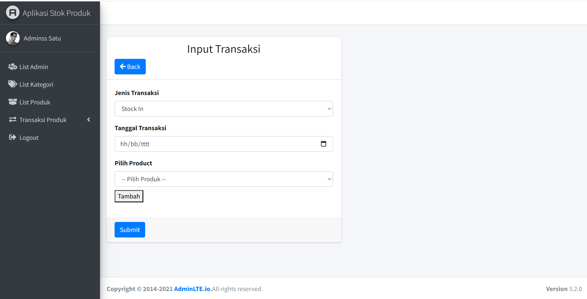
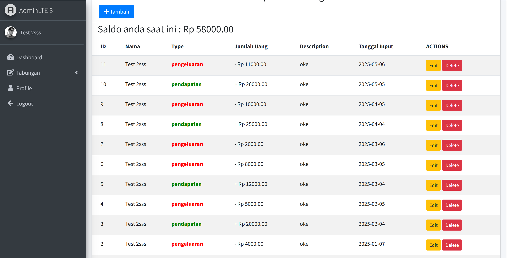
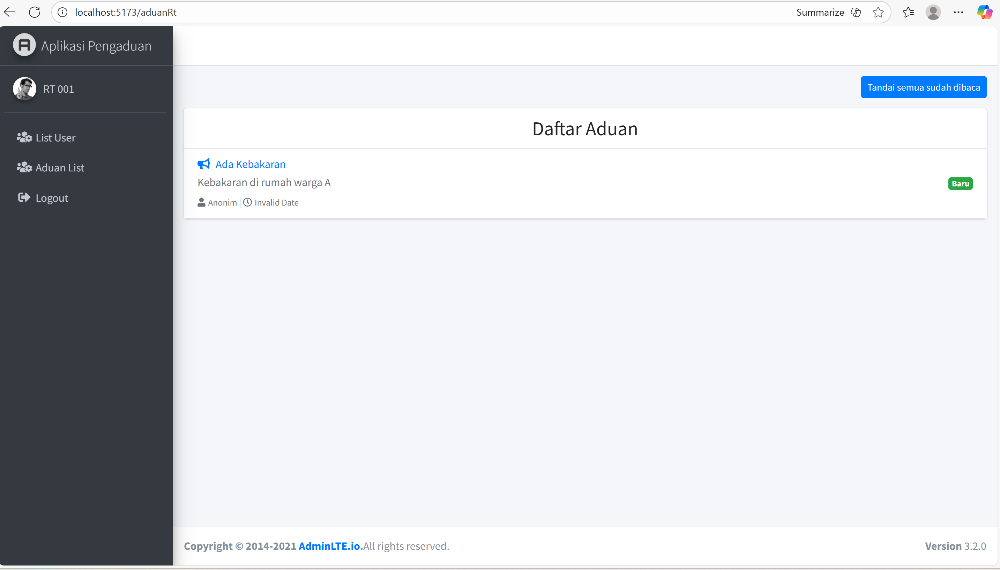
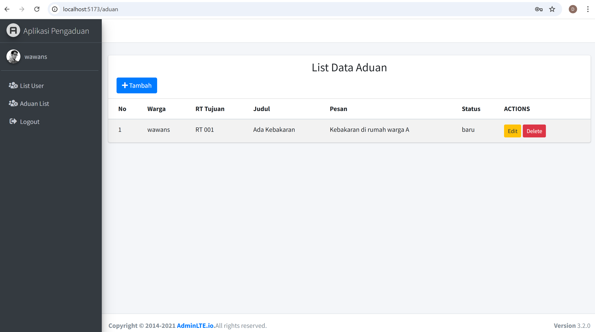

# 👋 Hi, I'm Dejan Jaya

**Fullstack Developer | PHP Developer | Backend Developer**

Saya adalah seorang Programmer dengan pengalaman 2 tahun dalam mengembangkan, memelihara, dan
menambahkan fitur baru pada aplikasi perangkat lunak perusahaan. Terbukti mampu menjaga kualitas aplikasi
yang telah digunakan secara efektif oleh pengguna. Berkomitmen untuk memberikan kontribusi positif dan
mencapai tujuan tim.

---

## 💼 Featured Projects

### 1. 🧾 Aplikasi Stok Produk

**Deskripsi:**
Aplikasi untuk mengelola data admin, kategori produk, data produk , da transaksi untuk mencatat terjadinya keluar masuk produk,
dan riwayat transaksi produk dengan fitur CRUD lengkap.

**Fitur Utama:**

- Login
- CRUD Data Admin, Produk & Kategori Produk
- Transaksi Keluar masuknya Produk
- Riwayat Transaksi Produk
- API Laravel terhubung ke React frontend
- Autentikasi Laravel Sanctum dan Validasi Input

**Teknologi:** Laravel, React.js, MySQL, Axios, AdminLTE

🔗 **Repository:**

- 🗄️ Backend (Laravel): [https://github.com/DejanJaya/backend-stokproduk]
- 💻 Frontend (React): [https://github.com/DejanJaya/frontend-stokproduk]

📸 **Screenshot:**

---

### 2. 💰 Aplikasi Tabungan Pendapatan & Pengeluaran

**Deskripsi:**
Aplikasi pencatatan keuangan sederhana untuk mencatat pemasukan dan pengeluaran harian dari user yang login

**Fitur Utama:**

- Login & Register
- CRUD Transaksi
- Perhitungan saldo otomatis
- Grafik pemasukan/pengeluaran per bulan
- Autentikasi Laravel Sanctum dan Validasi Input
- API Laravel(Restful)

**Teknologi:** Laravel, React.js, Chart.js, Axios, AdminLTE

🔗 **Repository:**

- 🗄️ Backend (Laravel): [https://github.com/DejanJaya/backend-tabungan]
- 💻 Frontend (React): [https://github.com/DejanJaya/frontend-tabungan]

📸 **Screenshot:**

---

### 3. 🏘️ Aplikasi Pengaduan Warga ke RT

**Deskripsi:**
Aplikasi pengaduan warga berbasis web yang mempermudah warga dalam menyampaikan laporan atau aduan langsung kepada pihak RT secara real-time. Setiap warga dapat membuat aduan, dan pihak RT akan menerima notifikasi otomatis tanpa perlu refresh halaman.

**Fitur Utama:**

- Login & Register
- Autentikasi menggunakan JWT (JSON Web Token)
- CRUD Data User (Admin/RT)
- Form Aduan untuk warga
- Daftar Aduan di halaman RT (update real-time menggunakan Laravel Reverb & Laravel Echo)
- Notifikasi otomatis ketika aduan baru dibuat
- Tampilan menggunakan React.js 19 + AdminLTE

**Teknologi:** Laravel 11, React.js 19, Laravel Reverb, Laravel Echo, Axios, SweetAlert2, AdminLTE

🔗 **Repository:**

- 🗄️ Backend (Laravel): [https://github.com/DejanJaya/backend-pengaduan]
- 💻 Frontend (React): [https://github.com/DejanJaya/frontend-pengaduan]

📸 **Screenshot:**

---

## 🧰 Skills & Tools

- **Backend:** PHP, Javascript, Codeigniter 3, Laravel, REST API, MySQL
- **Frontend:** React.js, Bootstrap, CSS, Jquery, Axios
- **Tools:** Git, VS Code, Composer, Postman, NPM

---

## 📫 Contact Me

📍 GitHub: [@DejanJaya](https://github.com/DejanJaya)
💼 LinkedIn: [linkedin.com/in/dejan-jaya-84128a169](#)
📧 Email: [dejanjaya0@gmail.com](mailto:dejanjaya0@gmail.com)

---

⭐ _Jangan lupa beri star di repository ini jika kamu suka dengan project-project saya!_
